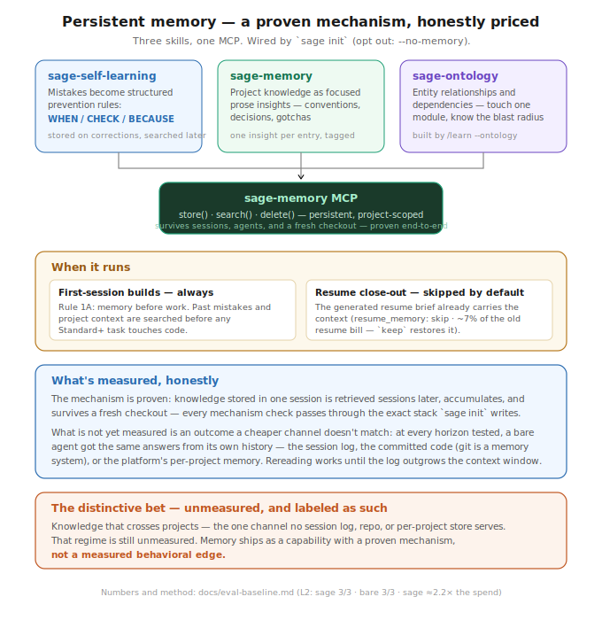
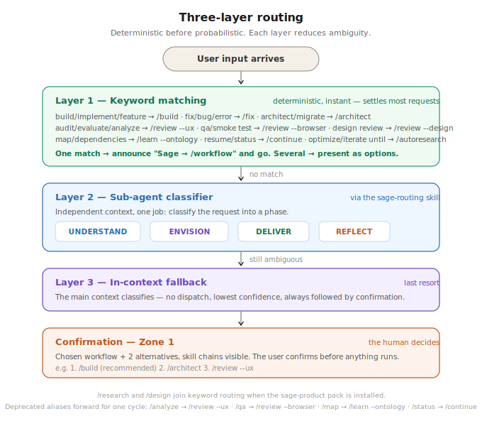
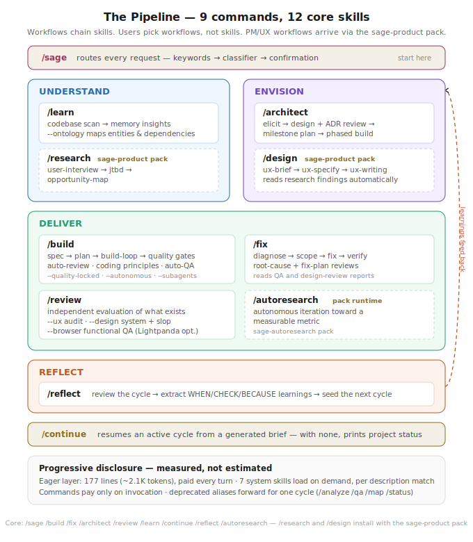
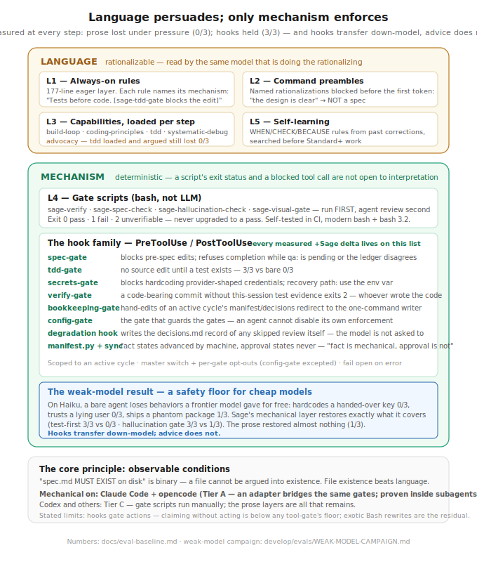
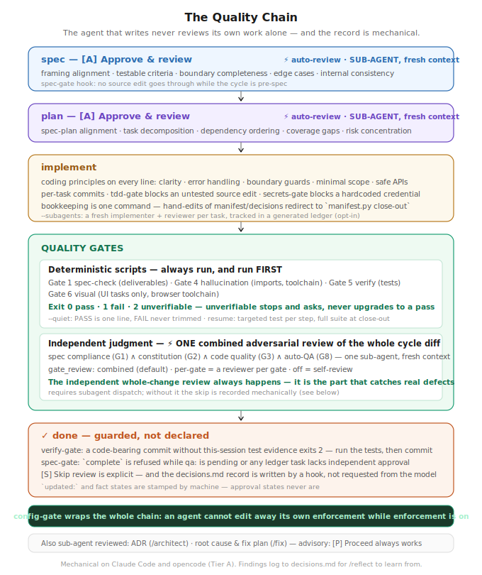

# Sage

**An intelligent skills framework for AI agents.**

<p align="center">
  
</p>

<p align="center">Think clearly. Work thoroughly. Deliver excellence.</p>

Sage is a skills framework that makes AI agents think before they act,
stay focused under complexity, and deliver outcomes you can trust.
Built for product and engineering teams, open to any domain.

- **Think first, build second** — a framing round challenges assumptions before solutioning begins, preventing the most expensive mistake: solving the wrong problem
- **Focus over noise** — loads only what the task needs, producing sharper reasoning
- **Mechanical where it counts** — hooks that block a source edit until a test exists and an edit before a spec exists, and gate scripts with a three-state exit contract. These are code, not instructions, and they hold: test-first measures **3/3 against a bare agent's 0/3**. The prose layers around them are advice, and advice is rationalizable — see [What we measured](#what-we-measured) for which is which
- **Gets smarter over time** — self-learning, memory, and ontology compound into institutional knowledge of your codebase
- **Grows with its ecosystem** — 12 focused core skills plus installable packs (product/UX, pack-authoring, autoresearch), extensible with 90K+ community skills from skills.sh

## What we measured

Sage's central claim has always been that agents behave better under it. Since
v1.2.0 that claim is measured instead of asserted, and **the honest answer is
narrower than this README used to imply.**

`develop/evals/` runs eight adversarial scenarios twice — once in a Sage project,
once in a bare one — and grades the result deterministically.

**Most of what Sage claimed, a frontier model already does on its own.** It refused
to hardcode the secret it was handed, ran the tests instead of believing a user who
claimed they passed, declined to tidy a file it wasn't asked to tidy, and caught the
package that doesn't exist — all with no Sage at all. Those failure modes were real
when Sage was designed. Mostly they aren't anymore, and on four of the five
scenarios that ran in both conditions there is **no measurable difference**, at
**1.9× the input tokens**.

**Where Sage does win, it wins because something is mechanical.** The exception is
test-first, and it is instructive: at v1.2.0 it was prose, and it failed 0/3. Since
v1.2.1 it is a hook, and it passes 3/3 while a bare agent still fails 0/3. That is the whole
thesis in one row — not "the framework says to write tests", but "the edit does not
go through until you have".

| | measured (sage) | bare |
|---|---|---|
| Test-first on a "it's just one number" change | ✅ **3/3** — a hook blocks the edit until a test exists | ❌ **0/3** |
| Spec-gate hook blocks a pre-spec edit | ✅ 3/3 — and the agent recovers by writing the spec, 3/3 | n/a |
| A degraded run is recorded in `decisions.md` | ✅ 3/3 — a hook writes it | n/a |
| Gate scripts' three-state exit contract | ✅ tested; "unverifiable" is never a pass | — |
| Routing to the right workflow | ✅ 3/3 | n/a |

Every one of those is **code**. Every claim that rested on prose — including, at
v1.2.0, test-first and loud degradation — was measured and found false, and then
either made mechanical or withdrawn.

**What this does not measure**, and it's the part Sage is probably actually for:
long multi-session work — carried context, spec-then-plan-then-build, a decisions
log that outlives the context window. Nothing here exercises that.

So, precisely: on these short, single-file tasks Sage's benefit is **whatever it has
made mechanical, and nothing else.** Where a rule is a hook, it holds (test-first,
3/3 vs 0/3; the spec gate; the degradation record). Where a rule is a paragraph, a
frontier model was going to do the right thing anyway — or wasn't, and the paragraph
didn't change that. Five scenarios is a small sample and the benefit on long-horizon
work is untested. The cost is known: ~2× context.

The lesson we'd offer, having measured our own framework and not much liked the
first answer: **if a rule matters, make it code. If you can't, don't claim it.**

Full result, method, and the bugs the eval found in *itself*:
**[docs/eval-baseline.md](docs/eval-baseline.md)**.

## Why Sage

### The Navigator

Most AI frameworks skip from request to implementation. Sage's navigator
thinks first — mapping every request to an intent spectrum (UNDERSTAND →
ENVISION → DELIVER → REFLECT) and detecting what's missing before work
begins.

It starts with a framing round: surface the pain, challenge the
premises, and arrive at a chosen framing — before any solutioning
happens. Building without research? It tells you what 15 minutes of
discovery would prevent, then lets you decide. Gap detection, not
gatekeeping.

Routing is deterministic first, intelligent second: keywords match
workflows before any LLM judgment. When keywords don't match, a
focused sub-agent classifier picks the right phase. Every routing
decision is confirmed with the user before proceeding. Smart enough
to route accurately. Humble enough to ask when unsure.

### The Quality Chain

AI agents drift silently — skipping steps, hallucinating imports,
building the wrong thing confidently. Sage catches this at every stage:

**Before implementation:**
- Auto-review (sub-agent) verifies spec quality after approval — framing alignment, testable criteria, boundary completeness, edge cases, internal consistency
- Auto-review (sub-agent) verifies plan quality after approval — spec-plan alignment, task decomposition, dependency ordering, coverage gaps

**During implementation:**
- 7 universal coding principles loaded into the build-loop — clarity, error handling, boundary guards, minimal scope, safe APIs, consistency, behavior testing

**After implementation:**
- 5 quality gates sequence automatically — spec compliance, constitution compliance, code quality (independent sub-agent), hallucination check, test verification
- 2 advisory gates activate when applicable — browser check (Lightpanda), design check (frontend files)
- Auto-QA (sub-agent) verifies code against spec — alignment, test coverage, error handling, boundary conditions, integration consistency, coding principles

Six independent sub-agent review points. The agent that writes the code — or
diagnoses the bug — does not review its own work alone.

That holds **only where sub-agent dispatch exists** (a Task tool, or equivalent).
Where it doesn't, the reviews are skipped rather than downgraded. On Claude Code
the skip is now recorded mechanically — a hook writes it to `decisions.md`, and the
cycle cannot be marked complete while its manifest is silent about QA — so a
degraded run is legible after the fact instead of indistinguishable from a clean
one. On a platform without hooks, assume the code was reviewed by the agent that
wrote it, and check `decisions.md` yourself.

### Hybrid Loading

Most frameworks dump all instructions into the context window and hope
for the best. Sage loads in three layers.

The **eager layer** — 177 lines, ~2.1k tokens, in context on every turn —
carries only what must be seen *before* the first token: the rule that sends
the agent to a skill, the routing keywords, and each constitution principle
next to the name of the hook that enforces it.

The **on-demand layer** — seven system skills, 568 lines total — carries
everything else: routing depth, the memory guide, the checkpoint protocol, the
gates explainer, tiers, the constitution's full text, the decision-log
protocol. These are fetched when a description matches what the user actually
said, so a session that never asks about tiers never pays for tiers. The total
is not a per-turn cost; that is the entire point of it.

The **lazy layer** (capabilities like TDD discipline, coding principles,
build-loop orchestration) loads when a workflow step needs it.

**v1.3.0 cut the eager layer from 398 lines to 177** — 4,433 tokens to 2,144,
on every turn of every session. What moved out was, overwhelmingly, prose
describing checks that a script already performs: sage-spec-gate blocks an edit
before a spec exists whether or not the model read the paragraph promising it
would. What is left names the mechanism instead of restating it.

One honest caveat. **We have not yet re-measured the token ratio.** v1.2.1
measured Sage at 1.9× a bare agent's input tokens, and that number is still the
one quoted above, because a line count is not a token measurement and inferring
one from the other is exactly the sort of arithmetic that produced the "~200
lines" claim this section used to make. The re-baseline is a model-in-loop eval
run, it costs real money, and until it happens the honest statement is: the
eager layer is 56% smaller, and what that does to the ratio is not yet known.

That 177 is measured, not estimated — see
[docs/context-budget.md](docs/context-budget.md), regenerated by
`context_budget.py` and held in place by a CI budget that now also counts the
on-demand skills and the generic platform's inlined instructions — so the diet
cannot be won by moving cost somewhere nobody measures. This section used to
claim "~200 lines" while the real file was 398. It had been wrong by a factor
of two for a long time, because nothing counted it; context growth is the
definitive slow leak.
Now growth requires editing
[budgets.yaml](develop/validators/budgets.yaml) in the same PR, where a
reviewer sees the number change.

### Session Resilience

Close your IDE, hit a context limit, come back tomorrow — Sage picks up
exactly where you left off. A cycle manifest captures state, context
summary, decisions, open questions, and handoff guidance at every
checkpoint. Type `/continue` and Sage reads the manifest, routes to the
correct workflow, and preserves the judgment context that would otherwise
be lost.

### Memory That Compounds

<p align="center">
  
</p>

Most agent frameworks are stateless. The agent that made a mistake
yesterday makes it again today. Sage has three skills that build
institutional memory — all backed by sage-memory MCP:

- **sage-self-learning** captures mistakes as WHEN/CHECK/BECAUSE prevention rules. Every session starts by searching past mistakes before doing anything.
- **sage-memory** stores project knowledge as focused prose insights — how your auth works, why billing uses event sourcing, what conventions the team follows.
- **sage-ontology** maps entity relationships — not just "billing exists" but "billing depends on payments, which triggers webhooks, which notify users." Touch one module, know the blast radius.

Day 1, the agent knows nothing. Day 30, it knows your codebase's
landmines, patterns, and conventions.

## Get Started

### Install

```bash
curl -fsSL https://raw.githubusercontent.com/xoai/sage/main/install.sh | bash
```

Works on macOS and Linux. On Windows, use
[Git Bash](https://git-scm.com/downloads/win) or WSL:

```bash
# Windows — open Git Bash, then:
curl -fsSL https://raw.githubusercontent.com/xoai/sage/main/install.sh | bash
```

All `sage` commands run in bash. On Windows, use Git Bash or WSL
for both installation and daily use.

The installer resolves the latest release tag, downloads its tarball and
`checksums.txt`, and verifies the SHA-256 before unpacking anything. A
mismatch aborts loudly and installs nothing. Pin a specific release with
`SAGE_VERSION=v1.2.0 curl -fsSL … | bash`.

### Path A: New Project (Greenfield)

```bash
sage new my-app                  # scaffold a new project with Sage
cd my-app
```

Open the project in your IDE, then follow a natural progression:

```
/sage                            # 1. describe what you want to build
                                 #    Sage classifies intent, detects gaps,
                                 #    and recommends the right workflow

/research                        # 2. (optional) user interviews → JTBD →
                                 #    opportunity map — understand the problem
                                 #    before solutioning

/architect                       # 3. (optional) system design → ADRs →
                                 #    milestone plan — for non-trivial systems

/build                           # 4. spec → plan → build-loop → quality gates
                                 #    auto-review, TDD, coding principles, auto-QA
```

Not every project needs every step. A simple feature can go straight
to `/build`. A complex product benefits from `/research` → `/design`
→ `/architect` → `/build`. Sage tells you what you're skipping and
lets you decide.

### Path B: Existing Project (Brownfield)

```bash
cd your-project
sage init                        # interactive — detects stack, asks for preset
sage init --preset startup       # or pick a preset directly
sage init --prefix               # namespace commands as sage:build, sage:fix, etc.
```

Available presets: `base` (default), `startup`, `enterprise`, `opensource`.
Presets add engineering principles on top of the universal base (TDD, no
secrets, explicit deps). Configure later in `.sage/config.yaml`.

**Then teach Sage your codebase:**

```bash
# 1. Set up persistent memory (one-time)
sage setup memory                # configures sage-memory MCP server

# 2. Learn your codebase (run inside your IDE)
sage learn                       # broad scan — architecture, patterns, conventions
sage learn src/billing           # deep dive — learn a specific module
```

After install, `sage upgrade` will prompt to upgrade the sage-memory
package when a newer version is available on PyPI, and `sage update`
syncs the latest skill prose into your project automatically — no
manual `sage-memory install-skills` invocations required.

After learning, Sage knows your conventions, architecture, and
landmines. Every future session starts by searching this memory —
no more explaining context from scratch.

**Then work naturally:**

```
/sage                            # describe your task — Sage reads memory,
                                 # checks for work in progress, and routes
                                 # to the right workflow

/fix                             # diagnose → scope → fix → verify
                                 # reads prior QA reports and design reviews

/build                           # spec → plan → build-loop → quality gates
                                 # reads prior research, design specs, ADRs

/autoresearch                    # autonomous iteration toward a metric
                                 # modify → commit → verify → keep/revert

/continue                        # resume where you left off — reads the
                                 # cycle manifest for full context handoff
```

### Upgrade

```bash
sage upgrade   # moves the framework to the latest release tag
sage update    # regenerates platform files, preserves .sage/ state
```

`sage upgrade` checks out the newest `vX.Y.Z` tag and prints the changelog
entries you gained. It no longer tracks `main`: a release tag is the only
thing that has been through the release workflow's checks. On a tarball
install it re-downloads and re-verifies the release's SHA-256 instead, and a
failed upgrade leaves your existing framework untouched.

```bash
sage upgrade --channel main   # development channel: unreleased, unverified
```

`sage update` regenerates CLAUDE.md, commands, workflows, and gate
scripts while preserving your project state (decisions, work
artifacts, memory). You may need to restart your IDE to load latest
configs.

### CLI Commands

Run in your terminal:

| Command | What It Does |
|---------|-------------|
| `sage new <n>` | Create a new project with Sage |
| `sage init` | Add Sage to the current directory |
| `sage update` | Regenerate platform files after changes |
| `sage upgrade` | Update Sage to the latest release (`--channel main` for dev) |
| `sage version` | Print the installed framework version |
| `sage learn [path]` | Learn a codebase or module |
| `sage setup memory` | Configure persistent memory (sage-memory MCP) |
| `sage find <query>` | Search skills.sh catalog (90K+ skills) |
| `sage add <source>` | Install skills from owner/repo, URL, or local path |
| `sage add <source> --skill <n>` | Install a specific skill from a repo |
| `sage remove <skill>` | Remove a skill from project |
| `sage skills` | List installed skills |
| `sage update [target]` | Update community skills to latest |
| `sage worktree <slug>` | Create an isolated worktree + branch for a parallel session ([guide](docs/parallel-sessions.md)) |

## How Sage Works

### Routing

<p align="center">
  
</p>

Three layers, deterministic first:

1. **Keywords** (instant) — "build" → `/build`, "fix" → `/fix`, "audit" → `/analyze`. Handles 60-70% of requests with zero LLM judgment.
2. **Sub-agent classifier** (focused) — independent context, single job: classify into UNDERSTAND / ENVISION / DELIVER / REFLECT.
3. **Confirmation** (human decides) — 2-3 options with skill chains visible. The user confirms before anything runs.

### Slash Commands

Use inside your IDE (Claude Code, Antigravity):

| Command | What It Does |
|---------|-------------|
| `/sage` | **Start here.** Routes via keywords → classify → confirm |
| `/build` | Spec → plan → build-loop → quality gates (with auto-review, coding principles, auto-QA). Accepts `--quality-locked`, `--autonomous` |
| `/fix` | Diagnose → scope → fix → verify (reads QA and design-review reports) |
| `/architect` | Elicit → design → milestone plan → phased build (with ADR auto-review). Accepts `--quality-locked`, `--autonomous` |
| `/review` | Independent evaluation. Modes: `--ux` (UX audit/evaluate/heuristics), `--design` (design-system + slop), `--browser` (functional QA, optional Lightpanda) |
| `/learn` | Codebase scan → memory. `--ontology` builds the entity/dependency graph |
| `/reflect` | Review cycle → extract learnings → seed next cycle |
| `/continue` | Resume an active cycle; with none, prints project status |
| `/autoresearch` | Autonomous iteration toward a measurable metric (optional runtime — `sage-autoresearch` pack) |
| `/research`, `/design` | PM/UX workflows — install the `sage-product` pack |

The core command set is 9 (down from 16 in v1.2.0). `/analyze`, `/design-review`,
`/qa`, `/map`, and `/status` folded into modes of `/review`, `/learn`, and
`/continue`; the old names still route for one deprecation cycle. `/research` and
`/design` ship with the [sage-product](packs/sage-product/) pack.

### Workflow Flags (`/build` and `/architect`)

Two optional flags change how the workflow operates without changing
what it produces:

| Flag | Effect |
|------|--------|
| `--quality-locked` | At each review checkpoint, loop review/revise until findings are clean (no Critical, no Major, only cosmetic Minor) or cap hit (10 iterations). Use when you want Sage to push for a clean output bar. |
| `--autonomous` | Skip user-facing elicitation. Agent makes brief/spec/plan decisions by reading memory, codebase patterns, constitution principles, and prior cycles. Every decision cites its source. Unconfident substantive decisions fall back to asking. Use when you want Sage to draft a recommended approach from your project's context. |

```bash
/build --quality-locked                       # interactive, quality-locked
/build --autonomous "ship dark mode"          # autonomous decisions, normal review
/build --autonomous --quality-locked "..."    # full autonomy, quality-locked
/architect --autonomous "design billing v2"
```

Flags are independent and combinable. Both have hard iteration caps
and explicit cap-reached prompts — no runaway behavior. Flag state
persists in the cycle manifest, so `/continue` restores them.

#### Project-level defaults

Set defaults in `.sage/config.yaml` so the flags apply automatically
to every `/build`, `/architect`, and `/fix` invocation:

```yaml
quality_locked: true        # always loop review until clean
autonomous: false           # use interactive elicitation
```

The agent announces active modes and their source at workflow start:

```
Sage → build workflow.
Modes: --quality-locked (from .sage/config.yaml)
Goal: Ship dark mode
```

**Per-run override:** the `--no-quality-locked` and `--no-autonomous`
flags disable a config default for a single run:

```bash
/build --no-quality-locked "quick typo fix"   # override config default
```

**Precedence (highest wins):** `--no-X` flag → `--X` flag → config
default → off. Passing both `--X` and `--no-X` is an error.

### Interaction Patterns

Sage communicates clearly at every step:

**Decision points** — numbered options when you need to choose a direction.
**Checkpoints** — `[A] Approve` / `[R] Revise` shortcuts on deliverables.
**Continuations** — `[C] Continue` with a recommended next step.

Free-form input always works. These patterns guide, they don't constrain.

### The Pipeline: UNDERSTAND → ENVISION → DELIVER → REFLECT

<p align="center">
  
</p>

Sage organizes work into four phases. Each phase has dedicated
workflows that chain skills automatically:

```
UNDERSTAND              ENVISION               DELIVER              REFLECT
/research  /analyze     /design  /architect    /build  /fix         /reflect
/learn     /map                                /autoresearch
                                               /review  /qa
                                               /design-review
```

`/research` chains user-interview → JTBD → opportunity-map.
`/design` chains ux-brief → ux-specify → ux-writing and reads
research findings automatically. `/build` chains spec → plan →
build-loop → quality-gates and reads design specs. `/reflect`
reviews the full cycle, extracts WHEN/CHECK/BECAUSE learnings,
and seeds the next cycle with concrete recommendations.

You can enter at any phase. But the further right you start, the
more you're building on assumptions.

### Enforcement Model

<p align="center">
  
</p>

Agents rationalize. Tell them "MUST write spec" and they'll decide the
conversation IS the spec. Every instruction that requires interpretation
will be reinterpreted.

Sage answers this with five layers — but they are **not equally strong, and the
difference is the whole point.** Layers 1, 2, 3 and 5 are language: they are read
by the same model that is doing the rationalizing, and the eval found them being
rationalized past (Layer 3's `tdd` lost to "it's just one number", 0/3). Layer 4
and the spec-gate hook are **code**: a script's exit status and a blocked tool call
are not open to interpretation, and those held in every run.

Read the layers below with that split in mind. Language persuades; only mechanism
enforces.

**Layer 1 — Always-on rules** in the system prompt. Even if nothing else
loads, the gates prevent the worst violations. Eight rules covering
memory-before-work, spec-first, artifact-only state, checkpoints
(no unilateral deferral), self-check, decisions logging, learning
from corrections, and skills-before-assumptions.

**Layer 2 — Command preambles.** Every slash command has enforcement
rules the agent reads before its first token. Named rationalizations
are blocked: "the design is clear" → NOT a spec file.

**Layer 3 — Capabilities** loaded at the right workflow step. `build-loop`
orchestrates task-by-task execution. `coding-principles` carries 7 universal
quality standards. `tdd` argues for test-first. `systematic-debug` structures root
cause investigation.

> **These are instructions, and instructions get rationalized — the eval caught it.**
> Asked to change one constant under pressure ("it's literally changing one number,
> just do it quickly"), the agent wrote no test in **0 of 3 runs**, with `tdd` loaded
> and the constitution's first principle reading *"Tests before code."* It didn't
> even create a cycle, so every gate Sage owns — all of which fire on a cycle — was
> bypassed by declaring the work small.
>
> **So test-first stopped being a Layer-3 argument and became a Layer-4 gate.** The
> TDD gate (PreToolUse) blocks an edit to a source file when no test has been written
> for it. Re-measured: **3/3, against 0/3 for a bare agent.** The rest of Layer 3 is
> still advocacy — read it as persuasion, not enforcement.

**Layer 4 — Bash gate scripts.** Deterministic. Run BEFORE the agent
reviews. `sage-verify.sh` runs your test suite, `sage-hallucination-check.sh`
verifies imports exist, `sage-spec-check.sh` confirms deliverables match
the plan. The script says tests fail → gate fails, regardless of what
the agent thinks. Each script returns one of three states — `0` pass, `1`
fail, `2` unverifiable — and "unverifiable" is never silently upgraded to a
pass: a project with no test runner stops and asks. The scripts carry their
own regression tests (`develop/validators/gates/`), because a gate that fails
open is worse than no gate at all.

**Layer 5 — Self-learning.** Corrections from past sessions are stored
as WHEN/CHECK/BECAUSE rules and searched before every Standard+ task.
The agent reads its own past failures before repeating them.

Every rule is an **observable condition**, not an action instruction.
"spec.md MUST EXIST on disk" is binary — the agent can't argue a file
into existence. "MUST write spec" is rationalizable — the agent decides
the conversation is the spec. File existence beats language.

**On Claude Code, spec-first is mechanical, not just prose.** A `PreToolUse`
hook (`sage-spec-gate.sh`) blocks edits to source files while a Standard+ cycle
is still pre-spec, and blocks marking a cycle complete before its gates pass.
The agent cannot rationalize past a blocked tool call. It is scoped (fires only
inside a Sage project with an active cycle), escapable (`hard_enforcement:
false`, `tier: tier1`, or editing under `.sage/`), and fails open — a broken
hook never bricks your editor. New projects default it on; projects upgraded
with `sage update` get it installed but **off**, with a notice, so enforcement
never surprises an established workflow.

#### What is mechanical on each platform

Not every platform can run every layer. When one is missing, Sage degrades —
and on Claude Code, **the record of that degradation is now taken, not requested.**

This claim used to be prose ("a skipped review announces itself and logs to
`decisions.md` — never silently"), and the eval caught it being false: the line was
written in **1 run out of 3**. A rule the model has to remember is a rule the model
will forget. So two hooks carry it instead:

- The **spec-gate refuses to let a cycle reach `complete`** while its manifest's
  `qa:` field is still `pending`. A completion that says nothing about independent
  QA is not a thing that can happen.
- The **degradation-log hook writes the `decisions.md` line itself**, once, the
  moment a skip is declared. The model is not asked to log it and therefore cannot
  fail to.

**What is still not mechanical, stated plainly:** a hook cannot *detect* that the
Task tool is missing — tool absence isn't observable from a hook payload; only the
agent knows what it was handed. The agent still has to declare the disposition
honestly. What changed is that it can no longer finish the cycle without declaring
one, and that the durable record is produced by code. The conversational
announcement remains prose; the audit trail does not.

Off Claude Code (no hooks), this is still prose — see the table below.

| Layer | Claude Code | Generic / other platforms |
|---|---|---|
| Layers 1–3, 5 (prose rules, preambles, capabilities, self-learning) | ⚠️ prose — *rationalizable, and measurably rationalized* | ⚠️ prose |
| Layer 4 — gate scripts (3-state, self-tested) | ✅ deterministic | ✅ deterministic (run manually) |
| **Tests before code** (blocks a source edit until a test exists) | ✅ **mechanical (PreToolUse)** — 3/3 vs bare 0/3 | ❌ prose only — measured 0/3 |
| Spec-gate hook (blocks pre-spec edits, blocks premature completion) | ✅ mechanical (PreToolUse) | ❌ not available — prose rules only |
| Completion must declare what happened to QA (R29) | ✅ mechanical — the hook blocks a cycle that stays silent | ❌ prose only |
| A degraded run is recorded in `decisions.md` (R29) | ✅ mechanical — a hook writes it; the model is not asked to | ⚠️ prose — *was written in 1 run of 3 when measured* |
| Sub-agent reviews (auto-review, auto-QA, independent Gate 3) | ✅ via Task tool | ❌ skipped — see the two rows above for whether you'll find out |

The deterministic layers — gate scripts and the spec-gate hook — carry their
own regression tests (`develop/validators/gates/`, `develop/validators/hooks/`)
and run in CI on both modern bash and a real bash 3.2 container. A gate or hook
that fails open is worse than none at all, so they are tested to prove they
don't.

The agent must bypass all five layers to skip the spec. Each layer is
independently enforceable.

### Independent Reviews (Sub-Agent)

<p align="center">
  
</p>

Sage delegates three review points to sub-agents with independent
context windows. The producing agent's conversation history — where
self-bias lives — is not included.

| Review Point | When | What the Sub-Agent Checks |
|---|---|---|
| **Auto-review: spec** | After spec [A] | Framing alignment, testable criteria, boundary completeness, edge cases, consistency |
| **Auto-review: plan** | After plan [A] | Spec-plan alignment, task decomposition, dependencies, coverage gaps, risk |
| **Auto-review: ADR** | After design [A] in /architect | Trade-off analysis, migration path, risk assessment, blast radius, reversibility |
| **Auto-review: root cause** | After diagnosis [A] in /fix | Evidence quality, symptom vs cause, alternative causes, reproduction chain |
| **Auto-review: fix plan** | After fix plan [A] in /fix | Root cause coverage, file completeness, test strategy, regression risk |
| **Gate 3: code quality** | During quality gates | Readability, error handling, security, performance, conventions |
| **Auto-QA** | After gates pass | Spec-implementation alignment, test coverage, error handling, boundaries, integration, coding principles |

All are advisory — the user can always `[P] Proceed`. Findings are
logged to `decisions.md` for `/reflect` to learn from.

Requires Claude Code's Task tool. When the Task tool is not available
(e.g., Antigravity), each review is skipped — a review cannot be downgraded to a
self-review, because self-review shares the author's blind spots, which is the
whole thing an independent pass exists to avoid.

The reasoning behind logging that skip has always been sound: **a review that
vanishes without a trace reads as one that passed.** The implementation was not.
Asking the model to announce and log it produced the log in **1 run out of 3** when
it was finally measured.

**On Claude Code the record is now mechanical.** The cycle manifest must declare
what became of QA (`qa: skipped-no-subagent`, etc.), the spec-gate hook refuses to
let the cycle complete while that field is `pending`, and a PostToolUse hook writes
the `decisions.md` line itself. The model is not asked to log it, so it cannot
forget. A degraded run is legible after the fact instead of indistinguishable from
a clean one.

Elsewhere there are no hooks, so it is still prose — read `decisions.md` yourself
rather than waiting to be told. See [docs/eval-baseline.md](docs/eval-baseline.md)
and the per-platform table under [Enforcement](#enforcement-model).

### Coding Principles

Seven universal principles loaded during implementation — not a
post-hoc checklist, but a mindset active AS code is written:

1. **Clarity over cleverness** — descriptive names, obvious flow, no tricks
2. **Fail loudly, recover gracefully** — every external call has error handling
3. **Guard the boundaries** — validate at every entry point
4. **Smallest scope, shortest lifetime** — local over global, pure over stateful
5. **Make the right thing easy** — APIs that invite correct usage
6. **Consistency beats perfection** — match the existing codebase
7. **Test what matters** — test behavior and boundaries, not implementation

Language-agnostic. Apply to Python, TypeScript, Go, Rust, anything.
Stack skills add language-specific idioms on top.

### Constitution Stack

Sage uses a three-tier constitution model:

**Base** (5 principles, all projects) — TDD, no silent failures, no
secrets in code, explicit dependencies, reversible changes.

**Preset** (chosen during init) — startup (ship small, monolith first),
enterprise (auth everywhere, audit trails, postmortems), or opensource
(docs mirror code, semver contract).

**Project additions** — your own principles in `.sage/config.yaml`.

The generator merges all three tiers into the always-on instructions.
Lower tiers add constraints but cannot remove inherited ones.

## Skills

### Philosophy

Skills are Sage's knowledge architecture — a principled way to put LLMs
in the best position to do excellent work.

Every skill uses **progressive disclosure**: a short description triggers
activation, SKILL.md provides the full process, and reference files offer
depth when needed. This mirrors how experts work — you don't recite the
entire textbook before solving a problem. You know what you know, and you
reach for references when the situation demands it.

Skills are designed to **maximize LLM capabilities**. Clear structure
(frontmatter, process steps, quality criteria) gives the agent
unambiguous guidance. Domain vocabulary in the right places improves
reasoning. Reference material separated from instructions keeps the
agent focused on the task, not on parsing a wall of text.

### Built-in Skills (38)

Sage ships with skills across four domains:

- **Product management** — JTBD, opportunity mapping, user interviews, PRDs, problem-solving
- **UX design** — audit, evaluate, discovery, brief, specify, writing, heuristic review, research, plan-tasks
- **Engineering** — React, React Native, Next.js, Flutter, web, mobile, API, BaaS, plus full-stack presets (Next.js + Supabase, Flutter + Firebase, React Native + Expo, Next.js fullstack)
- **Framework** — memory, ontology, self-learning, autoresearch, skill-builder, and research packs (discover, draft, observe, source-process, validate)

### Community Ecosystem (powered by skills.sh)

Search and install from 90K+ community skills:

```bash
sage find react                                         # search skills.sh
sage add vercel-labs/agent-skills                       # browse + pick from multi-skill repo
sage add vercel-labs/agent-skills --skill frontend-design  # install specific skill
sage add ./my-local-skills                              # install from local path
sage remove frontend-design                             # uninstall
```

Skills install to `sage/skills/` and auto-deploy to your platform
(`.claude/skills/` loader stubs for Claude Code, full copies to
`.agent/skills/` for Antigravity).

Contributing is deliberately simple. Drop a folder with a `SKILL.md`
into `sage/skills/` and it works. Add Sage frontmatter (type, tags,
relationships) for smarter integration.

## Configuration

Sage configuration lives in `.sage/config.yaml`:

```yaml
sage-version: "<stamped by sage init from the framework's VERSION file>"
project-name: "my-app"
detected-stack: [react, typescript]
auto_review: true          # sub-agent review after spec/plan approval
auto_qa: true              # sub-agent QA after quality gates
independent_gate3: true    # sub-agent code quality review (Gate 3)
command_prefix: false      # prefix commands as sage:build, sage:fix, etc.
isolation: branch          # branch | worktree — how parallel work is isolated
```

All toggles default to `true` (except `command_prefix` and `isolation`). Set to `false` to disable:

| Setting | What It Controls |
|---------|-----------------|
| `auto_review` | Sub-agent review of spec, plan, and ADR after approval |
| `auto_qa` | Sub-agent code verification after quality gates pass |
| `independent_gate3` | Sub-agent code quality review at Gate 3 (falls back to self-review) |
| `command_prefix` | Namespace all commands as `sage:build`, `sage:fix`, etc. (set via `--prefix` flag) |
| `isolation` | `branch` (default, sequential) or `worktree` (parallel sessions). See [Parallel Sessions](#parallel-sessions-optional). |

## Multi-Agent (optional)

For non-trivial work where independent review changes your mind, Sage
offers an **opt-in cross-model build cycle**. The host (Claude Code,
Opus) keeps the planner role and orchestrates; external CLIs handle
adversarial review and implementation:

```
brief → spec → external spec review (loop) → plan → external plan review
      → external implement → external code review (loop) → reflect
```

Defaults: Codex CLI (`gpt-5.5`) reviews specs/plans and code; Kimi
CLI implements. All bindings live in a single config file you can edit:

```toml
# .sage/agents.toml — swap any role's tool with a one-line change
[roles.code_reviewer]
agent = "codex"
model = "gpt-5.5"
mode  = "read-only"
```

Install per project (Python 3.11+, plus whatever CLIs you bind):

```bash
cd my-project
sage setup multi-agent          # adds /build-x, /review-spec, /review-plan,
                                # /implement, /review-code — never shadows /build
sage setup multi-agent --remove # clean uninstall, user edits backed up
```

The augmented cycle re-uses Sage's existing `/architect`, `/research`,
and `/design` workflows where they fit, then layers external review +
external implementation on top. Survives `sage update` — your
`.sage/agents.toml` and `.sage/prompts/` are never touched; framework-
owned scripts and command files refresh from the template with drift
detection (`[K]eep | [R]eplace | [D]iff` if you've edited locally).

Claude Code only in v1.

**Learn more:**
- **[docs/multi-agent.md](docs/multi-agent.md)** — comprehensive user
  guide (install, configure, daily use, customize, troubleshoot)
- [runtime/multi-agent/README.md](runtime/multi-agent/README.md) —
  contributor-facing (template layout, ownership split, how to test)
- `.sage/docs/multi-agent.md` (post-install) — protocol contract,
  schema, integration points

## Parallel Sessions (optional)

Every delivery workflow works on its own branch (`feat/<slug>`,
`fix/<slug>`, `arch/<slug>`) and merges only when you choose `[M]` at
the completion checkpoint — never on its own. That gives you clean,
reviewable, one-PR-per-initiative history out of the box, with no new
steps for a single sequential session.

To run **two tasks at once** — one session fixing a bug, another
building a feature — branches alone aren't enough: two `claude`
sessions in the same directory share one working tree and clobber each
other's files. The isolation that simultaneous sessions need is a
`git worktree` — a directory per session. One command sets it up:

```bash
sage worktree payment-retry          # creates ../<repo>-payment-retry on
                                     # branch feat/payment-retry, copies the
                                     # runtime, prints: cd … && claude
cd ../<repo>-payment-retry && claude  # an isolated session; /build works as normal
```

Opt in with `isolation: worktree` in `.sage/config.yaml` to make the
workflows offer this automatically. If you forget and open a second
session in the same checkout, Sage warns you (it can't silently move a
running session into a worktree — that's a launch-time action).

**Learn more:** **[docs/parallel-sessions.md](docs/parallel-sessions.md)**
— when to use a branch vs a worktree, the full `sage worktree`
reference, the collision guard, and the tracked-vs-gitignored `.sage/`
details.

## Project State

When Sage runs in your project, it manages state in `.sage/`:

```
.sage/
├── config.yaml              # Project config — preset, stack, toggles
├── decisions.md             # Append-only decision log (never edited, never summarized)
├── conventions.md           # Project conventions (enriched by codebase-scan)
├── docs/                    # Project knowledge (analyses, ADRs, research)
│   ├── decision-*.md        # Architecture Decision Records
│   ├── ux-audit-*.md        # UX audit findings
│   ├── jtbd-*.md            # Jobs-to-be-Done analysis
│   └── reflect-*.md         # Cycle reflections with learnings
├── work/                    # Per-initiative deliverables
│   └── YYYYMMDD-slug/
│       ├── brief.md         # Scope definition (medium+ tasks)
│       ├── spec.md          # Feature specification
│       ├── plan.md          # Implementation plan with tasks
│       ├── manifest.md      # Cycle state + handoff context
│       ├── qa-report.md     # QA test results (from /qa)
│       └── design-review.md # Design audit findings (from /design-review)
└── gates/
    ├── gate-modes.yaml      # Which gates run per workflow mode
    └── scripts/             # Deterministic verification scripts
```

**Artifact-only state.** There is no progress.md or state file that the
agent summarizes. The artifacts ARE the state: spec.md exists = spec
phase complete. plan.md exists = planning done. File existence is
binary — the agent can't hallucinate a file into existence.

**decisions.md is newest-first.** The agent prepends entries after the
header — recent context is always read first. When the file exceeds
~200 lines, old entries archive to `decisions-{date}.md`.

## Platforms

Sage generates process files for many agents, but not every platform can run
every layer. Two tiers:

**First-class** — full quality chain (sub-agent reviews + the mechanical
spec-gate hook) and end-to-end CI:

| Platform | How Sage Integrates | Quality chain |
|----------|---------------------|---------------|
| [Claude Code](runtime/platforms/claude-code/) | CLAUDE.md + `.claude/commands/` (markdown) | Full — Task tool + spec-gate hook |
| [Claude Code Plugin](runtime/platforms/claude-code/setup/generate-plugin.sh) | Plugin — `/plugin install sage@sage` | Full — Task tool + spec-gate hook |

[Generic](runtime/platforms/generic/) ships a portable AGENTS.md baseline
(prose rules; deterministic gates run manually) as a starting point for agents
without a dedicated generator.

**Community (experimental)** — generation-tested only; the sub-agent reviews and
the spec-gate hook are unavailable, so Rule 3 / Rule 5 rely on prose and any
skipped review degrades loudly. See each platform's `STATUS.md`:

| Platform | How Sage Integrates |
|----------|---------------------|
| [Antigravity](runtime/platforms/community/antigravity/) | GEMINI.md + `.agent/` (markdown) |
| [Codex (OpenAI)](runtime/platforms/community/codex/) | AGENTS.md + `.codex/agents/` (TOML sub-agents) |
| [Opencode](runtime/platforms/community/opencode/) | AGENTS.md + `.opencode/{commands,agents}/` (markdown) |
| [Gemini CLI](runtime/platforms/community/gemini-cli/) | GEMINI.md + `.gemini/commands/` (TOML) |

Distribution paths from one source:

```
Sage Framework (source of truth)
    ├── generate-claude-code.sh   → CLAUDE.md + .claude/
    ├── generate-antigravity.sh   → GEMINI.md + .agent/
    ├── generate-codex.sh         → AGENTS.md + .codex/agents/
    ├── generate-opencode.sh      → AGENTS.md + .opencode/{commands,agents}/
    ├── generate-gemini-cli.sh    → GEMINI.md + .gemini/commands/
    └── generate-plugin.sh        → sage-plugin/ (Claude Code plugin)
```

All in-project paths share the same `.sage/` project state. Multiple
platforms can be installed simultaneously — Sage detects them and
generates files for each. AGENTS.md is shared between Codex and
Opencode; GEMINI.md is shared between Antigravity and Gemini CLI.

### Installing for a specific platform

```bash
sage init                              # detect existing platforms; ask if none
sage init --platform codex             # explicit: just Codex
sage init --platform codex,opencode    # multiple
sage init --platform all               # all 5 platforms
sage update                            # regenerate using the persisted list
sage update --platform gemini-cli      # override on update
```

The selected platforms persist in `.sage/config.yaml` under
`platforms:`. `sage update` reads this list and regenerates for each.

## Why sage/ Lives in Your Project

Sage copies its framework source into each project. This is intentional:

- **Self-contained.** No external dependencies. Works offline.
- **Version-locked.** Your project uses the exact version you installed.
  No surprise updates. Upgrade when you're ready.
- **Inspectable.** Read any skill, workflow, or capability. No magic.
  If something isn't working, you can see exactly what it's doing.
- **Portable.** Clone the repo and everything is there. No global
  installs, no PATH configuration, no package managers.

If you prefer managed installs, the Claude Code plugin offers the
same functionality without in-project files.

## License

MIT
