# Sage

**An intelligent skills framework for AI agents.**

<p align="center">
  
</p>

<p align="center">Think clearly. Work thoroughly. Deliver excellence.</p>

Sage is a skills framework that makes AI agents think before they act,
stay focused under complexity, and deliver outcomes you can trust.
Built for product and engineering teams, open to any domain.

- **Think first, build second** — a framing round challenges assumptions before solutioning begins, preventing the most expensive mistake: solving the wrong problem
- **Focus over noise** — loads only what the task needs, producing sharper reasoning
- **Reliable by design** — 5-layer enforcement, 3 independent sub-agent reviews, quality gates with deterministic scripts
- **Gets smarter over time** — self-learning, memory, and ontology compound into institutional knowledge of your codebase
- **Grows with its ecosystem** — 37 built-in skills, extensible with 90K+ community skills from skills.sh

## Why Sage

### The Navigator

Most AI frameworks skip from request to implementation. Sage's navigator
thinks first — mapping every request to an intent spectrum (UNDERSTAND →
ENVISION → DELIVER → REFLECT) and detecting what's missing before work
begins.

It starts with a framing round: surface the pain, challenge the
premises, and arrive at a chosen framing — before any solutioning
happens. Building without research? It tells you what 15 minutes of
discovery would prevent, then lets you decide. Gap detection, not
gatekeeping.

Routing is deterministic first, intelligent second: keywords match
workflows before any LLM judgment. When keywords don't match, a
focused sub-agent classifier picks the right phase. Every routing
decision is confirmed with the user before proceeding. Smart enough
to route accurately. Humble enough to ask when unsure.

### The Quality Chain

AI agents drift silently — skipping steps, hallucinating imports,
building the wrong thing confidently. Sage catches this at every stage:

**Before implementation:**
- Auto-review (sub-agent) verifies spec quality after approval — framing alignment, testable criteria, boundary completeness, edge cases, internal consistency
- Auto-review (sub-agent) verifies plan quality after approval — spec-plan alignment, task decomposition, dependency ordering, coverage gaps

**During implementation:**
- 7 universal coding principles loaded into the build-loop — clarity, error handling, boundary guards, minimal scope, safe APIs, consistency, behavior testing

**After implementation:**
- 5 quality gates sequence automatically — spec compliance, constitution compliance, code quality (independent sub-agent), hallucination check, test verification
- 2 advisory gates activate when applicable — browser check (Lightpanda), design check (frontend files)
- Auto-QA (sub-agent) verifies code against spec — alignment, test coverage, error handling, boundary conditions, integration consistency, coding principles

Four independent sub-agent review points. The agent that writes the
code never reviews its own work alone.

### Hybrid Loading

Most frameworks dump all instructions into the context window and hope
for the best. Sage loads in two layers: the **eager layer** (process
rules, workflow gates, engineering principles — ~200 lines, always in
context) enforces what must never be skipped. The **lazy layer**
(capabilities like TDD discipline, coding principles, systematic
debugging, build-loop orchestration — loaded when the workflow step
needs them) adds depth without bloating context. A focused agent with
the right 500 tokens outperforms a distracted agent with 50,000 tokens
of everything.

### Session Resilience

Close your IDE, hit a context limit, come back tomorrow — Sage picks up
exactly where you left off. A cycle manifest captures state, context
summary, decisions, open questions, and handoff guidance at every
checkpoint. Type `/continue` and Sage reads the manifest, routes to the
correct workflow, and preserves the judgment context that would otherwise
be lost.

### Memory That Compounds

<p align="center">
  
</p>

Most agent frameworks are stateless. The agent that made a mistake
yesterday makes it again today. Sage has three skills that build
institutional memory — all backed by sage-memory MCP:

- **Self-learning** captures mistakes as WHEN/CHECK/BECAUSE prevention rules. Every session starts by searching past mistakes before doing anything.
- **Memory** stores project knowledge as focused prose insights — how your auth works, why billing uses event sourcing, what conventions the team follows.
- **Ontology** maps entity relationships — not just "billing exists" but "billing depends on payments, which triggers webhooks, which notify users." Touch one module, know the blast radius.

Day 1, the agent knows nothing. Day 30, it knows your codebase's
landmines, patterns, and conventions.

## Get Started

### Install

```bash
curl -fsSL https://raw.githubusercontent.com/xoai/sage/main/install.sh | bash
```

Works on macOS and Linux. On Windows, use
[Git Bash](https://git-scm.com/downloads/win) or WSL:

```bash
# Windows — open Git Bash, then:
curl -fsSL https://raw.githubusercontent.com/xoai/sage/main/install.sh | bash
```

All `sage` commands run in bash. On Windows, use Git Bash or WSL
for both installation and daily use.

### Create a Project

```bash
sage new my-app
```

### Or Add to an Existing Project

```bash
cd your-project
sage init                        # interactive — asks for platform and preset
sage init --preset startup       # non-interactive with preset
sage init --preset enterprise    # auth, audit trails, postmortems
```

Available presets: `base` (default), `startup`, `enterprise`, `opensource`.
Presets add engineering principles on top of the universal base (TDD, no
secrets, explicit deps). Choose during init or configure later in
`.sage/config.yaml`.

### Upgrade an Existing Project

```bash
sage update    # regenerates platform files, preserves .sage/ state
sage upgrade   # pulls latest Sage framework from GitHub
```

`sage update` regenerates CLAUDE.md, commands, workflows, and gate
scripts while preserving your project state (decisions, work
artifacts, memory). It also migrates stale patterns from previous
versions.

That's it. Open your project in your IDE, type `/sage`, and describe
what you want to build. Sage reads your project, assesses the task,
and guides you through the right process.

### CLI Commands

Run in your terminal:

| Command | What It Does |
|---------|-------------|
| `sage new <n>` | Create a new project with Sage |
| `sage init` | Add Sage to the current directory |
| `sage update` | Regenerate platform files after changes |
| `sage upgrade` | Update Sage to the latest version |
| `sage learn [path]` | Learn a codebase or module |
| `sage setup memory` | Configure persistent memory (sage-memory MCP) |
| `sage find <query>` | Search skills.sh catalog (90K+ skills) |
| `sage add <source>` | Install skills from owner/repo, URL, or local path |
| `sage add <source> --skill <n>` | Install a specific skill from a repo |
| `sage remove <skill>` | Remove a skill from project |
| `sage skills` | List installed skills |
| `sage update [target]` | Update community skills to latest |

## What It Looks Like

Type `/sage` and describe what you want to do. Sage reads your project,
assesses the task, and guides you:

```
> /sage
> Redesign our homepage for better conversion

Sage: Fresh project, no work in progress.

This looks like a comprehensive task — redesign involves understanding
what's not working before designing what's next.

[1] Start with UX audit of current homepage, then redesign
[2] Skip research, go straight to redesign
[3] Something else — describe what you have in mind

> 1

Sage → build workflow. Starting with UX audit. Reading ux-audit skill...

[Sage runs the audit, saves findings to .sage/docs/ux-audit-homepage.md]

Sage: UX audit complete. Key findings:
- Navigation is clear but CTA is buried below the fold
- Mobile load time is 4.2s (target: <2s)
- No social proof visible in first viewport

[C] Continue with brief  |  Or tell me what you'd like to do
```

Every step: structured options with `[1] [2] [3]`, saved artifacts,
recommended next step. You stay in control — Sage stays intelligent.

## How Sage Works

### Routing

<p align="center">
  
</p>

Three layers, deterministic first:

1. **Keywords** (instant) — "build" → `/build`, "fix" → `/fix`, "audit" → `/analyze`. Handles 60-70% of requests with zero LLM judgment.
2. **Sub-agent classifier** (focused) — independent context, single job: classify into UNDERSTAND / ENVISION / DELIVER / REFLECT.
3. **Confirmation** (human decides) — 2-3 options with skill chains visible. The user confirms before anything runs.

### Slash Commands

Use inside your IDE (Claude Code, Antigravity):

| Command | What It Does |
|---------|-------------|
| `/sage` | **Start here.** Routes via keywords → classify → confirm |
| `/build` | Spec → plan → build-loop → quality gates (with auto-review, coding principles, auto-QA) |
| `/fix` | Diagnose → scope → fix → verify (reads QA and design-review reports) |
| `/architect` | Elicit → design → milestone plan → phased build (with ADR auto-review) |
| `/research` | Interview → JTBD → opportunity map |
| `/design` | Brief → spec → copy (reads research context) |
| `/analyze` | UX audit → evaluation → findings |
| `/qa` | Browser-based functional testing (optional Lightpanda MCP) |
| `/design-review` | Design quality audit + AI slop detection + design system compliance |
| `/review` | Independent artifact evaluation via sub-agent delegation |
| `/learn` | Codebase scan → memory storage |
| `/reflect` | Review cycle → extract learnings → seed next cycle |
| `/continue` | Resume any active cycle with full context |
| `/status` | Compute project state from artifacts |

### Interaction Patterns

Sage communicates clearly at every step:

**Decision points** — numbered options when you need to choose a direction.
**Checkpoints** — `[A] Approve` / `[R] Revise` shortcuts on deliverables.
**Continuations** — `[C] Continue` with a recommended next step.

Free-form input always works. These patterns guide, they don't constrain.

### The Pipeline: UNDERSTAND → ENVISION → DELIVER → REFLECT

<p align="center">
  
</p>

Sage organizes work into four phases. Each phase has dedicated
workflows that chain skills automatically:

```
UNDERSTAND              ENVISION               DELIVER              REFLECT
/research  /analyze     /design  /architect    /build  /fix         /reflect
/learn                                         /review  /qa
                                               /design-review
```

`/research` chains user-interview → JTBD → opportunity-map.
`/design` chains ux-brief → ux-specify → ux-writing and reads
research findings automatically. `/build` chains spec → plan →
build-loop → quality-gates and reads design specs. `/reflect`
reviews the full cycle, extracts WHEN/CHECK/BECAUSE learnings,
and seeds the next cycle with concrete recommendations.

You can enter at any phase. But the further right you start, the
more you're building on assumptions.

### Enforcement Model

<p align="center">
  
</p>

Agents rationalize. Tell them "MUST write spec" and they'll decide the
conversation IS the spec. Every instruction that requires interpretation
will be reinterpreted. Sage solves this with 5 independent enforcement
layers and observable conditions that can't be argued away.

**Layer 1 — Always-on rules** in the system prompt. Even if nothing else
loads, the gates prevent the worst violations. Seven rules covering
spec-first, artifact-only state, checkpoints, self-check, decisions
logging, learning from corrections, and memory search.

**Layer 2 — Command preambles.** Every slash command has enforcement
rules the agent reads before its first token. Named rationalizations
are blocked: "the design is clear" → NOT a spec file.

**Layer 3 — Capabilities** loaded at the right workflow step. `build-loop`
orchestrates task-by-task execution. `coding-principles` enforces 7
universal quality standards. `tdd` enforces test-first. `systematic-debug`
structures root cause investigation.

**Layer 4 — Bash gate scripts.** Deterministic. Run BEFORE the agent
reviews. `sage-verify.sh` runs your test suite, `sage-hallucination-check.sh`
verifies imports exist, `sage-spec-check.sh` confirms deliverables match
the plan. The script says tests fail → gate fails, regardless of what
the agent thinks.

**Layer 5 — Self-learning.** Corrections from past sessions are stored
as WHEN/CHECK/BECAUSE rules and searched before every Standard+ task.
The agent reads its own past failures before repeating them.

Every rule is an **observable condition**, not an action instruction.
"spec.md MUST EXIST on disk" is binary — the agent can't argue a file
into existence. "MUST write spec" is rationalizable — the agent decides
the conversation is the spec. File existence beats language.

The agent must bypass all five layers to skip the spec. Each layer is
independently enforceable.

### Independent Reviews (Sub-Agent)

Sage delegates three review points to sub-agents with independent
context windows. The producing agent's conversation history — where
self-bias lives — is not included.

| Review Point | When | What the Sub-Agent Checks |
|---|---|---|
| **Auto-review: spec** | After spec [A] | Framing alignment, testable criteria, boundary completeness, edge cases, consistency |
| **Auto-review: plan** | After plan [A] | Spec-plan alignment, task decomposition, dependencies, coverage gaps, risk |
| **Auto-review: ADR** | After design [A] in /architect | Trade-off analysis, migration path, risk assessment, blast radius, reversibility |
| **Gate 3: code quality** | During quality gates | Readability, error handling, security, performance, conventions |
| **Auto-QA** | After gates pass | Spec-implementation alignment, test coverage, error handling, boundaries, integration, coding principles |

All are advisory — the user can always `[P] Proceed`. Findings are
logged to `decisions.md` for `/reflect` to learn from.

Requires Claude Code's Task tool. When Task tool is not available
(e.g., Antigravity), reviews are skipped silently.

### Coding Principles

Seven universal principles loaded during implementation — not a
post-hoc checklist, but a mindset active AS code is written:

1. **Clarity over cleverness** — descriptive names, obvious flow, no tricks
2. **Fail loudly, recover gracefully** — every external call has error handling
3. **Guard the boundaries** — validate at every entry point
4. **Smallest scope, shortest lifetime** — local over global, pure over stateful
5. **Make the right thing easy** — APIs that invite correct usage
6. **Consistency beats perfection** — match the existing codebase
7. **Test what matters** — test behavior and boundaries, not implementation

Language-agnostic. Apply to Python, TypeScript, Go, Rust, anything.
Stack skills add language-specific idioms on top.

### Constitution Stack

Sage uses a three-tier constitution model:

**Base** (5 principles, all projects) — TDD, no silent failures, no
secrets in code, explicit dependencies, reversible changes.

**Preset** (chosen during init) — startup (ship small, monolith first),
enterprise (auth everywhere, audit trails, postmortems), or opensource
(docs mirror code, semver contract).

**Project additions** — your own principles in `.sage/config.yaml`.

The generator merges all three tiers into the always-on instructions.
Lower tiers add constraints but cannot remove inherited ones.

## Skills

### Philosophy

Skills are Sage's knowledge architecture — a principled way to put LLMs
in the best position to do excellent work.

Every skill uses **progressive disclosure**: a short description triggers
activation, SKILL.md provides the full process, and reference files offer
depth when needed. This mirrors how experts work — you don't recite the
entire textbook before solving a problem. You know what you know, and you
reach for references when the situation demands it.

Skills are designed to **maximize LLM capabilities**. Clear structure
(frontmatter, process steps, quality criteria) gives the agent
unambiguous guidance. Domain vocabulary in the right places improves
reasoning. Reference material separated from instructions keeps the
agent focused on the task, not on parsing a wall of text.

### Built-in Skills (37)

Sage ships with skills across four domains:

- **Product management** — JTBD, opportunity mapping, user interviews, PRDs, problem-solving
- **UX design** — audit, evaluate, discovery, brief, specify, writing, heuristic review, research, plan-tasks
- **Engineering** — React, React Native, Next.js, Flutter, web, mobile, API, BaaS, plus full-stack presets (Next.js + Supabase, Flutter + Firebase, React Native + Expo, Next.js fullstack)
- **Framework** — memory, ontology, self-learning, skill-builder, and research packs (discover, draft, observe, source-process, validate)

### Community Ecosystem (powered by skills.sh)

Search and install from 90K+ community skills:

```bash
sage find react                                         # search skills.sh
sage add vercel-labs/agent-skills                       # browse + pick from multi-skill repo
sage add vercel-labs/agent-skills --skill frontend-design  # install specific skill
sage add ./my-local-skills                              # install from local path
sage remove frontend-design                             # uninstall
```

Skills install to `sage/skills/` and auto-deploy to your platform
(`.claude/skills/` loader stubs for Claude Code, full copies to
`.agent/skills/` for Antigravity).

Contributing is deliberately simple. Drop a folder with a `SKILL.md`
into `sage/skills/` and it works. Add Sage frontmatter (type, tags,
relationships) for smarter integration.

## Configuration

Sage configuration lives in `.sage/config.yaml`:

```yaml
sage-version: "1.1.0"
project-name: "my-app"
detected-stack: [react, typescript]
auto_review: true          # sub-agent review after spec/plan approval
auto_qa: true              # sub-agent QA after quality gates
independent_gate3: true    # sub-agent code quality review (Gate 3)
```

All toggles default to `true`. Set to `false` to disable:

| Setting | What It Controls |
|---------|-----------------|
| `auto_review` | Sub-agent review of spec, plan, and ADR after approval |
| `auto_qa` | Sub-agent code verification after quality gates pass |
| `independent_gate3` | Sub-agent code quality review at Gate 3 (falls back to self-review) |

## Project State

When Sage runs in your project, it manages state in `.sage/`:

```
.sage/
├── config.yaml              # Project config — preset, stack, toggles
├── decisions.md             # Append-only decision log (never edited, never summarized)
├── conventions.md           # Project conventions (enriched by codebase-scan)
├── docs/                    # Project knowledge (analyses, ADRs, research)
│   ├── decision-*.md        # Architecture Decision Records
│   ├── ux-audit-*.md        # UX audit findings
│   ├── jtbd-*.md            # Jobs-to-be-Done analysis
│   └── reflect-*.md         # Cycle reflections with learnings
├── work/                    # Per-initiative deliverables
│   └── YYYYMMDD-slug/
│       ├── brief.md         # Scope definition (medium+ tasks)
│       ├── spec.md          # Feature specification
│       ├── plan.md          # Implementation plan with tasks
│       ├── manifest.md      # Cycle state + handoff context
│       ├── qa-report.md     # QA test results (from /qa)
│       └── design-review.md # Design audit findings (from /design-review)
└── gates/
    ├── gate-modes.yaml      # Which gates run per workflow mode
    └── scripts/             # Deterministic verification scripts
```

**Artifact-only state.** There is no progress.md or state file that the
agent summarizes. The artifacts ARE the state: spec.md exists = spec
phase complete. plan.md exists = planning done. File existence is
binary — the agent can't hallucinate a file into existence.

**decisions.md is append-only.** The agent adds entries, never edits
or summarizes past ones. No lossy compression.

## Platforms

Sage is platform-agnostic. It works wherever AI agents work.

| Platform | How Sage Integrates | Status |
|----------|---------------------|--------|
| [Claude Code](runtime/platforms/claude-code/) | CLAUDE.md + `.claude/commands/` with slash commands | Full |
| [Antigravity](runtime/platforms/antigravity/) | GEMINI.md + `.agent/` with rules, skills, workflows | Full |
| [Claude Code Plugin](runtime/platforms/claude-code/setup/generate-plugin.sh) | Plugin format — install with `/plugin install sage@xoai` | Full |

Three distribution paths from one source:

```
Sage Framework (source of truth)
    ├── generate-claude-code.sh → CLAUDE.md + .claude/ (in-project)
    ├── generate-antigravity.sh → GEMINI.md + .agent/ (in-project)
    └── generate-plugin.sh      → sage-plugin/ (Claude Code plugin)
```

Both in-project paths share the same `.sage/` project state. Switch
platforms mid-project. The plugin path manages its own installation
via Claude Code's plugin system.

## Why sage/ Lives in Your Project

Sage copies its framework source into each project. This is intentional:

- **Self-contained.** No external dependencies. Works offline.
- **Version-locked.** Your project uses the exact version you installed.
  No surprise updates. Upgrade when you're ready.
- **Inspectable.** Read any skill, workflow, or capability. No magic.
  If something isn't working, you can see exactly what it's doing.
- **Portable.** Clone the repo and everything is there. No global
  installs, no PATH configuration, no package managers.

If you prefer managed installs, the Claude Code plugin offers the
same functionality without in-project files.

## License

MIT
