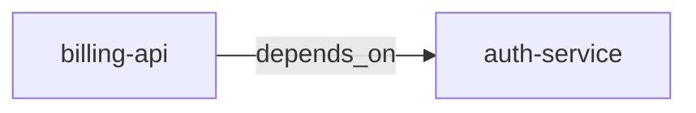

# Map Workflow

Build and maintain a typed knowledge graph of the codebase's structure.
Creates ontology entities (modules, services, APIs) and their
relationships (depends_on, calls, part_of) in sage-memory.

**Prerequisite:** sage-memory MCP tools must be available. If not,
announce: "sage-memory is required for /map. Install it first." and stop.

Read `skills/ontology/SKILL.md` for entity encoding format and
`skills/ontology/references/encoding.md` for full examples BEFORE
creating any entities.

## Step 1: Determine Scope

If a path is specified, that's the target — deep dive.
If no path, offer scope options.

Sage: What would you like to map?

[1] Broad scan — map project-level modules, services, and dependencies
[2] Deep dive — map a specific module's internal structure and connections
[3] Refresh — update existing ontology with current codebase state

## Step 2: Search Existing Ontology

Search sage-memory for existing ontology entries. Use tags ["ontology"]
as a filter, limit 20.

**Graph exists (results found):**

Sage: Found {N} existing entities in the knowledge graph.
Types: {list of entity types found}
Domains: {list of domain tags found}

Building on existing graph — will add new entities and update stale ones.

**No graph yet:**

Sage: No existing knowledge graph. Starting fresh.

**Refresh mode:** Also scan for stale entities — entities whose source
modules/files no longer exist in the codebase. List them for the user
to confirm deletion.

## Step 3: Scan Codebase

Read project structure to discover structural elements worth mapping.

### Broad Scan

1. **Project root:** Read package files (package.json, go.mod, Cargo.toml,
   pyproject.toml, etc.) for dependencies and project structure
2. **Top-level directories:** Identify modules, services, packages —
   each major directory that represents a distinct concern
3. **Entry points:** Main files, API route definitions, CLI commands,
   exported interfaces
4. **Inter-module imports:** Trace which modules import from which other
   modules to discover dependency relationships
5. **External services:** Database connections, API clients, message
   queues, external service integrations

Focus on the structural skeleton. Do NOT read every file — read
directory listings, entry points, and import statements.

### Deep Dive

1. **Target module:** Read the target directory structure
2. **Internal components:** Key files, classes, services within the module
3. **External connections:** What this module imports from other modules,
   what other modules import from this one
4. **Data flow:** How data enters, transforms, and exits the module
5. **Interfaces:** Public APIs, exported types, event contracts

### Refresh

1. **Read existing entities** from ontology
2. **Verify each entity** still corresponds to existing code
3. **Scan for new structure** not yet in the graph
4. **Identify stale entities** to remove

## Step 4: Present Discovered Structure

Present what you found BEFORE storing anything.

Sage: Discovered structure for {project/module name}:

**Entities to create:**

| Type | Name | Domain |
|------|------|--------|
| Project | auth-service | auth |
| Project | billing-api | billing |
| Document | /api/v1/payments | billing, api |
| ... | ... | ... |

**Relations to create:**

| Relation | From | To |
|----------|------|-----|
| depends_on | billing-api | auth-service |
| part_of | /api/v1/payments | billing-api |
| ... | ... | ... |

**Mermaid diagram:**



{For Refresh: also show entities to update and entities to delete}

🔒 **CHECKPOINT:**

[A] Looks correct — store these entities
[R] Revise — some things are wrong or missing
[D] Deep dive — map a specific area in more detail

Pick A/R/D, or tell me what to change.

## Step 5: Store Ontology

After user approval, create entities and relations in sage-memory
using the ontology encoding format.

**Entity encoding:**

For each entity, call sage_memory_store with:
- title: "[{Type}:{id}] {descriptive name}" (string)
- content: JSON object with id, type, properties (string)
- tags: ["ontology", "entity", "{type_lower}", "{domain}"] (array of strings)
- scope: "project" (string)

**Relation encoding:**

For each relation, call sage_memory_store with:
- title: "[Rel:{rel_type}] {source_label} → {target_label}" (string)
- content: JSON object with from_id, from_type, rel, to_id, to_type (string)
- tags: ["ontology", "rel", "{rel_type}", "edge:{from_id}", "edge:{to_id}"] (array of strings)
- scope: "project" (string)

**ID format:** `{type_prefix}_{8_hex}` — generate with first 4 chars
of type lowercase + 8 random hex chars.

**MCP parameter types:** tags must be an actual array, not a JSON
string. scope and title are strings. Get the types right.

**For Refresh mode:**
- New entities: create normally
- Changed entities: use sage_memory_update with the entry ID
- Stale entities: use sage_memory_delete (delete relations first,
  then the entity)

## Step 6: Summary

Sage: Knowledge graph updated.

Created: {N} entities, {M} relations
Updated: {U} entities (Refresh only)
Deleted: {D} stale entities (Refresh only)

```mermaid
{final diagram of the full graph or the section that was mapped}
```

[C] Continue — map another area
[L] /learn — capture prose knowledge about this area
[S] /status — see project state

Type a command, or describe what you want to do next.

## Guidelines

- **10-25 entities** for broad scans, **5-15** for deep dives
- Map structural units only — modules, services, APIs, key components
- NOT every file or function
- Search ontology before creating to avoid duplicates
- When in doubt about whether something is worth mapping, ask: "Would
  a future agent need to know this exists and what it connects to?"
- Use `Project` for modules/services, `Document` for APIs/routes/configs
- Use `depends_on` for module-level dependencies, `part_of` for
  containment (component within module)

## Rules

- Read `skills/ontology/SKILL.md` BEFORE creating any entities
- Search existing ontology BEFORE creating — never duplicate
- Present structure BEFORE storing — checkpoint is mandatory
- sage-memory MCP is required — no file-based fallback for ontology
- Do NOT store implementation details — only structural relationships
- Every entity must have domain tags for searchability
- Verify entity encoding matches the format in references/encoding.md
